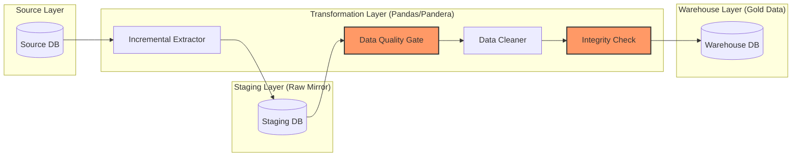

# Attendance Data Pipeline: Production-Grade ETL with Observability

[](https://www.python.org/downloads/)
[](https://www.mysql.com/)
[](https://github.com/trinhnguyen212/attendance-data-pipeline/actions)

## 🚀 Executive Summary

This project is a production-ready ETL (Extract, Transform, Load) pipeline designed to move attendance data from a source system into a data warehouse while guaranteeing **100% data integrity**. 

Unlike basic scripts, this system is built for **observability**. It doesn't just move data; it audits it. Every execution generates a detailed JSON run report that quantifies exactly how many rows were processed and—more importantly—why specific rows were dropped (e.g., schema violations, deduplication, or referential integrity failures).

### The Problem
In real-world data environments, "silent data corruption" is the biggest risk. Missing emails, invalid status codes, or orphaned records can leak into a warehouse, leading to incorrect business reports and flawed decision-making.

### The Solution
A three-phase, layered architecture that treats data quality as a first-class citizen:
1. **Extraction**: An incremental pull strategy using high-water marks to minimize database load.
2. **Transformation**: A rigorous cleaning layer powered by **Pandera** for schema enforcement and business-rule validation.
3. **Loading**: A final commit to the Warehouse layer, ensuring only "Gold" quality data is persisted.

---

## 🏗️ Architecture



---

## 🛠️ Key Technical Decisions (The "Why")

### 1. Pandera for Schema Enforcement
**Why?** To prevent "silent corruption." 
Standard Pandas cleaning is fragile. I integrated **Pandera** to enforce strict type-checking and regex-based validation (e.g., email formats) before the data ever touches the warehouse. If the data doesn't match the contract, it's flagged.

### 2. Structured JSON Run Reports
**Why?** For operational observability.
Logging is for developers; reports are for stakeholders. Every run produces a `run_report_{timestamp}.json` containing:
- **Lineage**: Total rows extracted vs. total rows loaded.
- **Drop Analysis**: Exact counts for `null_critical_fields`, `invalid_status`, `duplicates`, and `referential_integrity`.
- **Performance**: Execution duration and throughput metrics.

### 3. Incremental Loading Strategy
**Why?** For scalability.
Loading millions of rows every hour is unsustainable. I implemented a **High-Water Mark (HWM)** strategy, querying only records where `created_at > last_successful_run`. This reduces network overhead and database locking.

### 4. Golden Dataset Regression Testing
**Why?** To eliminate "logic drift."
I maintain a "Golden Dataset" (input vs. expected output). This ensures that any optimization in the `DataCleaner` doesn't accidentally change the way attendance is calculated, providing a mathematical guarantee of correctness.

---

## 📊 Data Quality Observability in Action

By implementing the `RunReport` utility, I can quantify the health of the source data. Below are examples of how the pipeline reports its findings.

### ✅ Success Case: Clean Data
When the source data is healthy, the report shows a 0% drop rate.
```json
{
    "status": "success",
    "total_extracted": 100,
    "total_loaded": 100,
    "net_drop_rate": 0.0,
    "rows_dropped": {
        "null_critical_fields": 0,
        "invalid_status": 0,
        "duplicates": 0,
        "referential_integrity": 0
    }
}
```

### ⚠️ Warning Case: Dirty Data
When "bad" data is injected, the report pinpoints the exact failure mode, allowing the business to fix the source system.
```json
{
    "status": "success",
    "total_extracted": 100,
    "total_loaded": 85,
    "net_drop_rate": 0.15,
    "rows_dropped": {
        "null_critical_fields": 5,
        "invalid_status": 7,
        "duplicates": 2,
        "referential_integrity": 1
    }
}
```

---

## 🧗 Engineering Journey: Challenges & Resolutions

Building a pipeline is easy; building a **reliable** one is hard. Here are the key challenges I solved during development:

### 1. The "CI/CD Environment" Gap
**Challenge:** The pipeline worked locally but failed in GitHub Actions with Pydantic validation errors.
**Discovery:** I found that Pydantic was unable to locate the `.env` file in the CI environment and was falling back to default system variables, leading to missing `DB_NAME` configurations.
**Resolution:** I refactored the GitHub Actions workflow to explicitly map required environment variables, ensuring a consistent configuration between local and remote environments.

### 2. The "Empty Set" Crash
**Challenge:** The pipeline would crash during the Transformation phase if the Extractor found 0 new records.
**Discovery:** Operations like sorting and deduplication on empty Pandas DataFrames were triggering unexpected errors in the business logic.
**Resolution:** I implemented robust empty-frame guards throughout the `DataCleaner` class, allowing the pipeline to complete successfully with "0 rows processed" rather than failing.

### 3. The "Silent Corruption" Risk
**Challenge:** Simple `df.dropna()` calls were removing rows without telling anyone *why* they were removed.
**Discovery:** Without an audit trail, the business would never know if data was missing because of a bug or because the source data was poor.
**Resolution:** I developed the `RunReport` system and integrated **Pandera**. Now, every single dropped row is categorized and counted, turning a "black box" process into a transparent data audit.

---

## 🚦 Quick Start (Recruiter Mode)

The fastest way to run this project is via Docker.

1. **Clone and Setup**
   ```bash
   git clone https://github.com/trinhnguyen212/attendance-data-pipeline.git
   cd attendance-data-pipeline
   ```

2. **Start the Infrastructure**
   ```bash
   docker-compose up -d db
   ```

3. **Seed the Source Database**
   ```bash
   docker-compose run --rm app python scripts/seed_data.py
   ```

4. **Run the Pipeline**
   ```bash
   docker-compose run --rm app python main.py
   ```

5. **Inspect the Result**
   Check the `run_report_*.json` file in the root directory to see the data quality metrics.

---

## 📂 Project Structure
- `main.py`: Pipeline orchestrator.
- `pipeline/extractor.py`: Handles incremental pulls from Source $\rightarrow$ Staging.
- `pipeline/transformer.py`: The "Brain" — handles cleaning and validation.
- `pipeline/quality_checks.py`: Pandera schema definitions and Quality Gates.
- `pipeline/loader.py`: Final loading into the Warehouse.
- `pipeline/observability.py`: Logic for generating the JSON run reports.
- `tests/`: Suite of unit and regression tests.
