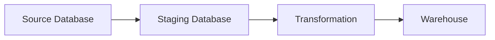

# Attendance Data Pipeline

A production-ready ETL pipeline designed to synchronize attendance data from operational source systems into a centralized data warehouse. This project demonstrates professional data engineering patterns, including incremental loading, multi-layer staging, and rigorous data quality validation.

---

## 🏛️ Architecture



The pipeline follows a three-layer architecture to ensure data integrity and system stability:

- **Source Database**: The system of record containing raw operational data.
- **Staging Database**: A transient landing zone used to isolate the extraction process from the transformation logic, preventing source system locking.
- **Warehouse**: The final analytics layer containing cleaned, validated, and deduplicated "Gold" data.

---

## ✨ Features

- **Incremental Extraction**: Uses a High-Water Mark (HWM) strategy to pull only records created or updated since the last successful run.
- **Multi-Stage Transformation**: Implements a robust cleaning pipeline including whitespace trimming and binary status validation.
- **Referential Integrity**: Dynamically validates attendance records against existing users in the warehouse to prevent orphaned records.
- **Idempotent Loading**: Utilizes an UPSERT pattern (`INSERT ... ON DUPLICATE KEY UPDATE`) to ensure data consistency without causing primary key collisions.
- **Data Quality Gates**: Integrated validation layer that blocks corrupted batches from reaching the warehouse.
- **Automated Testing**: Comprehensive suite including unit, integration, and golden dataset regression tests.

---

## 🛠️ Technology Stack

| Technology | Purpose |
| :--- | :--- |
| **Python 3.11** | Core programming language |
| **Pandas** | Data manipulation and transformation |
| **SQLAlchemy** | Database orchestration and connection pooling |
| **MySQL** | Relational storage for Source, Staging, and Warehouse |
| **Docker** | Containerization for environment consistency |
| **Pytest** | Automated testing framework |

---

## 📂 Project Structure

- `main.py`: The pipeline orchestrator that manages the sequence of ETL phases.
- `pipeline/`: Core logic directory.
    - `extractor.py`: Handles incremental pulls using high-water marks.
    - `transformer.py`: Implements cleaning and referential integrity logic.
    - `loader.py`: Manages UPSERT loading into the Warehouse.
    - `quality_checks.py`: Defines data quality gates and validation rules.
- `scripts/`: Utility scripts, including `seed_data.py` for environment initialization.
- `tests/`: Comprehensive test suite (unit, integration, and regression).
- `config.py`: Centralized configuration and environment variable management.

---

## ⚙️ ETL Workflow

### Extract
The pipeline implements **Incremental Extraction**. Instead of reloading the entire dataset, it queries the Warehouse for the latest `created_at` timestamp (the High-Water Mark). Only records in the source database with a timestamp newer than the HWM are extracted into the Staging area.

### Transform
Data is processed through a cleaning pipeline to ensure "Gold" quality:
- **Deduplication**: Removes duplicate attendance records based on user and session IDs.
- **Cleaning**: Trims whitespace from string fields.
- **Validation**: Ensures `attendance_status` is a strict binary value (0 or 1).
- **Referential Integrity**: Validates that every attendance record references a valid user existing in the Warehouse.

### Load
The loader implements **Idempotent Loading**. Using a temporary table and a MySQL UPSERT statement, the pipeline merges new data into the Warehouse. This ensures that existing records are updated and new records are appended without creating duplicates.

---

## 🚀 Quick Start

### Installation
```bash
git clone https://github.com/trinhnguyen212/attendance-data-pipeline.git
cd attendance-data-pipeline
```

### Execution
1. **Start Infrastructure**
   ```bash
   docker-compose up -d db
   ```

2. **Initialize Source Data**
   ```bash
   docker-compose run --rm app python -m scripts.seed_data
   ```

3. **Run Pipeline**
   ```bash
   docker-compose run --rm app python main.py
   ```

---

## 🧪 Running Tests

The project includes a comprehensive testing suite executed within the Docker container to ensure environment parity.

```bash
docker-compose run --rm -e PYTHONPATH=/app app pytest
```

**Test Categories:**
- **Unit Tests**: Validate individual transformation and cleaning functions.
- **Integration Tests**: Verify database connectivity and SQL execution.
- **Golden Dataset Regression Test**: Compares pipeline output against a known "perfect" dataset to ensure no regressions in logic.

---

## 📉 Validation Scenarios

| Test | Purpose | Expected Result |
| :--- | :--- | :--- |
| **1. Initial Full Load** | Verify first pipeline execution | Full extract, warehouse populated with all source data |
| **2. No New Data** | Verify incremental logic | No new records extracted, nothing loaded |
| **3. New Records** | Verify incremental extraction | Only new records extracted and loaded |
| **4. Updated Record (UPSERT)** | Verify updates | Existing warehouse record updated, no duplicate key error |
| **5. Data Quality Rules** | Verify transformation | Invalid or duplicate records are removed before loading |

---

## 🛠️ Troubleshooting

If you encounter schema mismatches or wish to reset the environment to a clean state:

```bash
# Wipe all database volumes and stop containers
docker-compose down -v

# Restart the database
docker-compose up -d db

# Re-seed and execute
docker-compose run --rm app python -m scripts.seed_data
docker-compose run --rm app python main.py
```

---

## 📝 Example Pipeline Output

```text
Starting Attendance Data Pipeline...
----------------------------------------
[Phase 1: Extraction]
Extracting users...
✓ Incremental extract from 2026-07-16 10:00:00...
No new data found for users.

Extracting attendance_results...
✓ Incremental extract from 2026-07-16 10:00:00...
Successfully extracted 1 rows into attendance_results.
Extraction complete.

[Phase 2: Transformation]
Cleaning user data...
Cleaning attendance data...
Referential Integrity: Using warehouse users (incremental load) - Loaded 25 IDs
Transformation complete. 1 attendance records verified.

[Phase 3: Loading]
Loading 1 rows into warehouse table attendance_results...
Successfully loaded attendance_results via UPSERT.
Warehouse loading complete.
----------------------------------------
Pipeline completed successfully!
```

---

## 🚀 Future Improvements

- **Orchestration**: Implement Apache Airflow for scheduling and dependency management.
- **Cloud Migration**: Transition to AWS (RDS/S3) for production scalability.
- **Observability**: Implement a Data Quality Dashboard using Grafana or Streamlit.
- **CDC**: Move from timestamp-based extraction to Change Data Capture (CDC) via Debezium.
- **CI/CD**: Implement GitHub Actions for automated testing and deployment.
